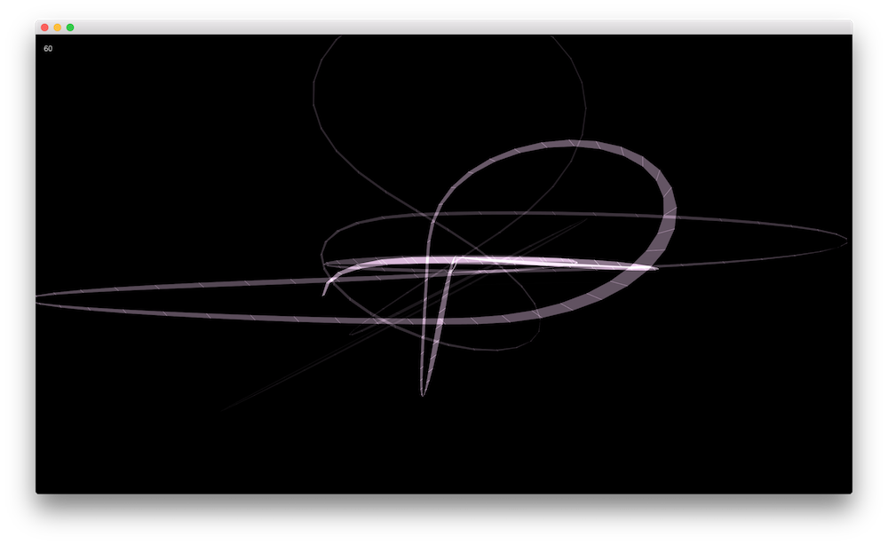

Simple example of making a mesh ribbon with perlin noise in Cinder 0.9.0 - trying to learn about differences between openFrameworks and Cinder methods of working. 

This is not an efficient way to do mesh creation (my next goal), but it got me close to some behavior of a simple openFrameworks app I had created.

Put online in case it might be useful for others. Needs a lot of other stuff like normals, lights, materials, etc, but demonstrates some concepts fairly simply.

